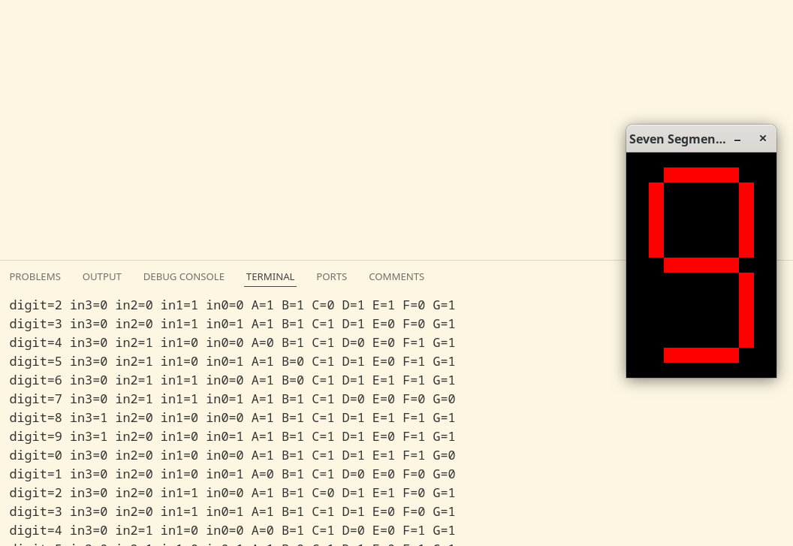

Create AND, OR, and NOT gate nodes. Based on input numbers, retrieve the corresponding Boolean logic expressions from the seven-segment display truth table. Calculate the switching signals for each segment and use SDL to generate a simulation animation.

